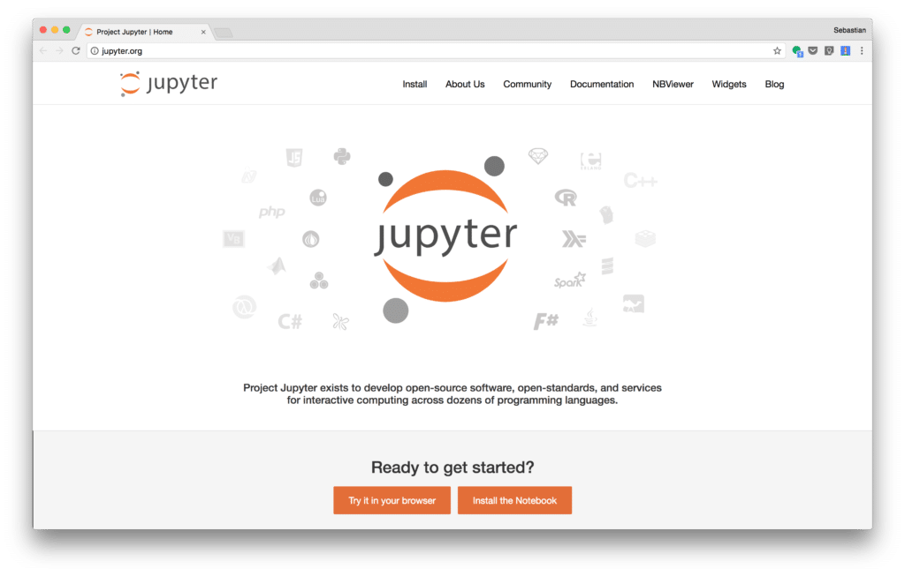
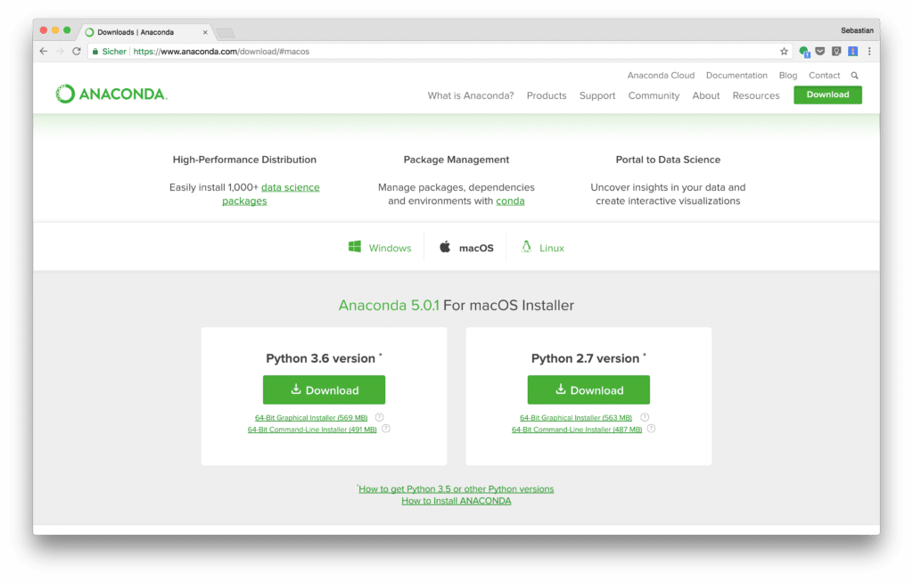
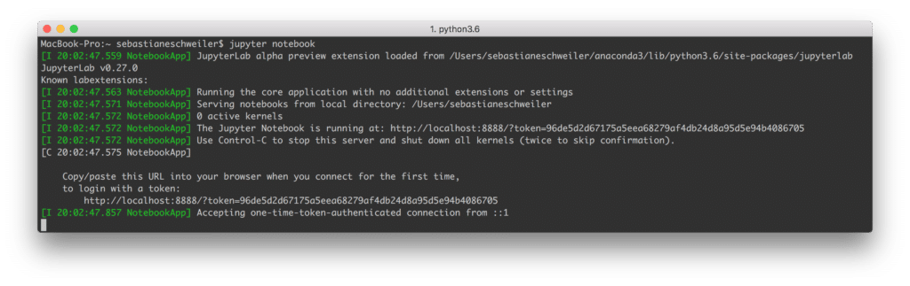
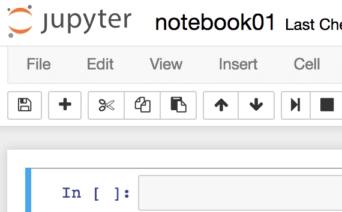
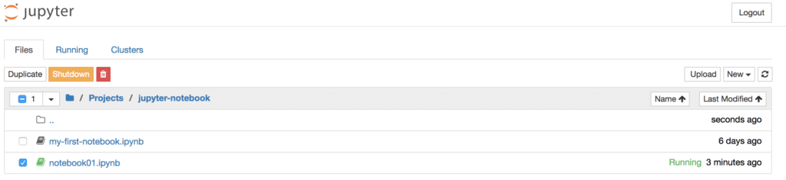
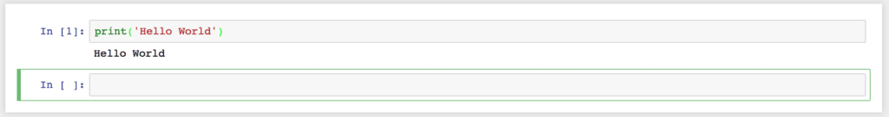
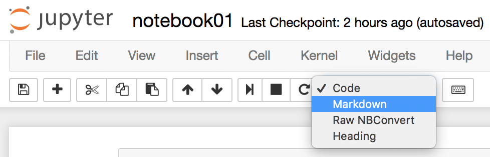

## Cài đặt Jupyter Notebook cho Python

### Jupyter Notebook là gì?

Jupyter Notebook là một ứng dụng web cho phép người dùng tạo và chia sẻ các văn bản chứa đựng:

- Live code (ví dụ: Python code).
- Visualization (hình ảnh, ...).
- Markdown text.

Jupyter Notebook rất thích hợp cho các use case sau:

- Mới bắt đầu học Python.
- Thử nghiệm và xác minh tính đúng đắn của ý tưởng, giải thuật, ...
- Xử lý dữ liệu.
- Học máy.
- ...

### Cài đặt Jupyter Notebook

Bạn có thể theo dõi [video sau](https://www.youtube.com/watch?v=CwFq3YDU6_Y) và làm theo hoặc tham khảo các bước dưới đây.

Đầu tiên, vào [trang web của jupyter](http://www.jupyter.org).



Có hai lựa chọn:

- Thử trước trên browser.
- Cài đặt Notebook.

Trước khi cài đặt, bạn có thể thử trước một phiên bản đã được host sẵn của Jupyter Notebook.

Sau khi trải nghiệm thử, tiến hành cài đặt. Có hai lựa chọn cài đặt:

- Cài đặt thông qua package manager của Python là `pip`.
- Cài đặt thông qua bản phân phối [Anaconda](https://conda.io/docs/index.html) của python.

Ở đây mình đề nghị sử dụng Anaconda, sau khi cài đặt Anaconda mặc định đã chứa sẵn Jupyter Notebook nên rất tiện.

Vào [link sau](https://www.anaconda.com/download/) để tới trang hướng dẫn cài đặt Anaconda:



Cài đặt Anaconda step by step thì bạn tham khảo ở [đây](https://www.digitalocean.com/community/tutorials/how-to-install-anaconda-on-ubuntu-18-04-quickstart).

Sau khi cài đặt xong Anaconda, mở terminal và chạy lệnh sau để khởi động Jupyter Notebook:

```sh
jupyter notebook
```



Web server của Jupyter được start và ứng dụng sẽ được mở tự động trên browser. Giao diện ứng dụng như sau:


Như vậy, bạn đã cài đặt thành công Jupyter Notebook.

### Tạo Notebook mới

Nhấn vào menu `New`, chọn `Python 3` để tạo Notebook mới cho Python. Giao diện notebook như sau:


Có thể đổi tên notebook:



Quay về trang trước sẽ thấy một file đuôi `.ipynb`



### Làm việc với Notebook

Notebook chứa các cell. Trong cell, bạn có thể nhập code, markdown, ... Để chạy cell, dùng tổ hợp phím Shift + Enter (sẽ nhảy xuống cell dưới hoặc tạo cell mới nếu chưa có) hoặc Ctrl + Enter (không nhảy xuống cell dưới):



Có thể đổi kiểu của cell sang kiểu khác như `Markdown`:



**Note**: Một cell có thể chạy đi chạy lại nhiều lần và không nhất thiết phải chạy các cell theo thứ tự từ trên xuống dưới.

Vẫn còn rất nhiều tính năng thú vị của Jupyter Notebook, bài này chỉ nhằm mục đích giới thiệu tổng quan nên không thể bao quát hết được. Bạn có thể tìm hiểu thêm ở trang chủ của [Jupyter](http://jupyter.org/documentation).

## Tham khảo

- [Medium - Getting started with Jupyter Notebook for Python](https://medium.com/codingthesmartway-com-blog/getting-started-with-jupyter-notebook-for-python-4e7082bd5d46).
- [Conda Documentation](https://conda.io/docs/index.html).